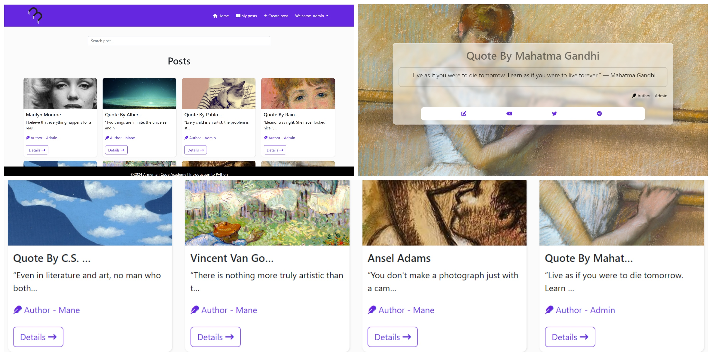

# myblogs: A Personal Blogging App

### myblogs is a web application that allows you to easily create, manage, and share your blog posts.

### Features
- **Create and edit blog posts:** Write your heart out and express yourself through text, images, and videos.
- **Update and delete posts:** Keep your content fresh and accurate by easily updating or deleting existing posts.
- **Share publicly or privately:** Choose to share your posts publicly with the world or keep them private for your eyes only.
- **Discover other blogs: Explore** a variety of posts from other users and discover new perspectives and interests.
- **Simple and intuitive interface:** Navigate the app with ease thanks to its user-friendly design.

## To run this application, you'll need the following software installed on your system:

- **Git:** Ensure you have Git installed on your system. You can download it from https://git-scm.com/downloads.
- **Python:** Verify that you have Python 3.x installed. Check the version using python3 --version in your terminal. If you don't have it, download the appropriate installer from https://www.python.org/downloads/.
- **pip:** Pip is the package installer for Python. Use python3 -m ensurepip to install it if necessary.

## To run this application follow these steps

1. **Clone this repository:**
   git clone [https://github.com/manevardazaryan1/myblogs]

2. **Create a Virtual Environment (Recommended):**
    **Using venv (Python 3.3+):**
    cd [REPOSITORY_NAME]  # Navigate to your project directory
    python3 -m venv venv  # Create a virtual environment named 'venv'
    source venv/bin/activate  # Activate the virtual environment

    **Using virtualenv (Older Python versions or external package manager):**
    cd [REPOSITORY_NAME]  # Navigate to your project directory
    virtualenv venv  # Create a virtual environment named 'venv'
    source venv/bin/activate  # Activate the virtual environment

3. **Install Dependencies:**
    pip install -r requirements.txt

4. **Run Database Migrations:**
    python manage.py migrate

5. **Start the Development Server:**
    python manage.py runserver

This command starts the Django development server, typically running at http://127.0.0.1:8000/ by default. You can access your Django application in a web browser at this URL.

[Tap to Top ⬆](#top)